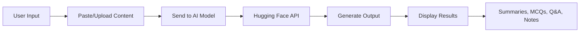

<div align="center">

# 📘 SummaraX

### AI-Powered Study Material Generator

Transform your educational content into exam-ready study materials using cutting-edge AI

[](LICENSE)
[](https://reactjs.org/)
[](https://huggingface.co/)

</div>

---

## 📖 Overview

**SummaraX** is an AI-driven web application that transforms large educational content—textbook chapters, PDFs, notes, and typed text—into comprehensive, exam-ready study materials. Powered by state-of-the-art NLP models from Hugging Face, SummaraX helps students study smarter, not harder.

### What SummaraX Generates

- ✅ **Clear and concise summaries** (short, medium, or detailed)
- ✅ **Multiple Choice Questions (MCQs)** with answer keys
- ✅ **Short & Long-answer questions**
- ✅ **Concept explanations** and definitions
- ✅ **Smart revision notes** with key points and formulas
- ✅ **Practice questions** categorized by difficulty level

---

## ✨ Features

### 🔹 AI-Powered Summaries

Generate customizable summaries using advanced models like **BART** and **T5**. Choose between short, medium, or detailed summaries based on your study needs.

### 🔹 Intelligent Question Generation

Create exam-style questions including:

- Multiple Choice Questions (MCQs)
- Short answer questions
- Long answer questions
- Conceptual questions

Powered by **Mistral-7B** and **Falcon-7B** language models.

### 🔹 Smart Revision Notes

Automatically extract and organize:

- Key points and takeaways
- Important formulas and equations
- Definitions and terminology
- Core concepts

### 🔹 Clean & Intuitive Interface

A responsive React-based UI that makes studying effortless:

- Paste text directly or upload documents (PDF support coming soon)
- Clean, distraction-free layout
- Easy-to-read formatted output

### 🔹 No Backend Required

SummaraX operates entirely on the frontend, directly interacting with the Hugging Face Inference API for seamless performance.

---

## 🧠 How It Works



1. **Input**: User pastes study material or uploads a document
2. **Processing**: Content is sent to AI models via Hugging Face API
3. **Generation**: AI generates summaries, questions, and notes
4. **Output**: Results are displayed in a clean, formatted interface

---

## 🛠️ Tech Stack

### Frontend

- ⚛️ **React.js** - Modern UI framework
- 🎨 **CSS / Tailwind CSS** - Styling (optional)
- 🔗 **Axios** - HTTP client for API calls

### AI Models (Hugging Face)

- **Summarization**:
  - `facebook/bart-large-cnn`
  - `t5-base`
  - `or a better model for summarization`
- **Question Generation**:
  - `mistralai/Mistral-7B-Instruct`
  - `tiiuae/falcon-7b-instruct`
- **Extractive Q&A**:
  - `deepset/roberta-base-squad2`

---

## 🚀 Getting Started

### Prerequisites

- Node.js (v14 or higher)
- npm or yarn
- Hugging Face API key ([Get one here](https://huggingface.co/settings/tokens))

### Installation

1. **Clone the repository**

   ```bash
   git clone https://github.com/sathyaprajith/SummaraX.git
   cd SummaraX
   ```

2. **Install dependencies**

   ```bash
   npm install
   ```

3. **Set up environment variables**

   Create a `.env` file in the root directory:

   ```env
   REACT_APP_HUGGINGFACE_API_KEY=your_api_key_here
   ```

4. **Start the development server**

   ```bash
   npm start
   ```

5. **Open your browser**

   Navigate to `http://localhost:3000`

---

## 📝 Usage

1. **Open SummaraX** in your browser
2. **Paste or type** your study material into the text area
3. **Select the type** of content you want to generate:
   - Summary
   - MCQs
   - Questions & Answers
   - Revision Notes
4. **Click Generate** and wait for the AI to process your content
5. **Review and study** the generated materials

---

## 🗺️ Roadmap

- [ ] PDF upload and text extraction
- [ ] Export generated content as PDF
- [ ] Support for multiple languages
- [ ] User accounts and saved study materials
- [ ] Flashcard generation
- [ ] Custom AI model selection
- [ ] Mobile app version
- [ ] Browser extension

---

## 🤝 Contributing

Contributions are welcome! Please feel free to submit a Pull Request.

1. Fork the repository
2. Create your feature branch (`git checkout -b feature/AmazingFeature`)
3. Commit your changes (`git commit -m 'Add some AmazingFeature'`)
4. Push to the branch (`git push origin feature/AmazingFeature`)
5. Open a Pull Request

---

## 📄 License

This project is licensed under the MIT License - see the [LICENSE](LICENSE) file for details.

---

## 👨‍💻 Author

**Sathya Prajith**

- GitHub: [@sathyaprajith](https://github.com/sathyaprajith)

---

## 🙏 Acknowledgments

- [Hugging Face](https://huggingface.co/) for providing powerful AI models
- The open-source community for inspiration and tools
- All contributors who help improve SummaraX

---

<div align="center">

**Made with ❤️ for students everywhere**

⭐ Star this repo if you find it helpful!

</div>
